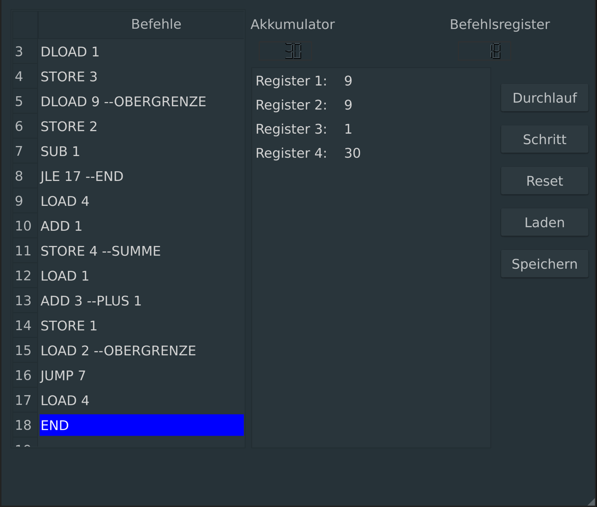

register machine 102
==

Better implementation of rm101, a fake assembler for educational purposes.  



Installation
==
A python3 environment and pip are required.  
`make`  
`make install`  

Package rm102 to a single excutable for Linux, macOS or Windows
==
`python3 -m pip install pyinstaller`  

Linux and Mac:  
=
```
pyuic5 -o rm102/mainwindow.py mainwindow.ui
pyuic5 -o rm102/help_dialog.py help_dialog.ui
pyinstaller --noconsole --onefile ./bin/rm102
```

Windows:  
=
```
pyuic5 -o .\rm102\mainwindow.py mainwindow.ui
pyuic5 -o .\rm102\help_dialog.py help_dialog.ui
pyinstaller.exe --noconsole --onefile .\bin\rm102
```
